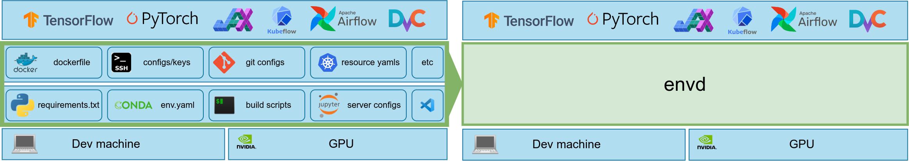
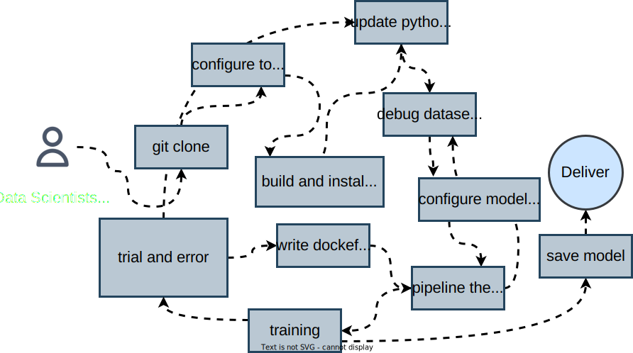
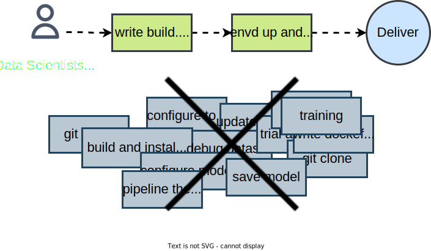

<div align="center">
<h1>envd</h1>
<p>Development environment for data science and AI/ML</p>
</div>

<p align=center>
<a href="https://github.com/tensorchord/envd/actions/workflows/CI.yml"></a>
<a href="https://pypi.org/project/envd/">
<a href="https://discord.gg/KqswhpVgdU"></a>
<a href="https://twitter.com/TensorChord"></a>
<a href="https://github.com/tensorchord/envd#contributors-"></a>
</p>

> **⚠️ envd is still under heavy development, and subject to change. it is not feature-complete or production-ready. Please contact us in [discord](https://discord.gg/KqswhpVgdU) if there is any problem.**

envd is a **machine learning development environment** for data science and AI/ML engineering teams.

🐍 **No Docker, only Python** - Focus on writing Python code, we will take care of Docker and development environment setup.

🖨️ **Built-in Jupyter/VSCode** - First-class support for Jupyter and VSCode remote extension.

⏱️ **Save time** - Better cache management to save your time, keep the focus on the model, instead of dependencies.

☁️ **Local & cloud** - `envd` integrates seamlessly with Docker so that you can easily share, version, and publish `envd` environments with Docker Hub or any other OCI image registries.

🔁 **Repeatable builds & reproducible results** - You can reproduce the same dev environment on your laptop, public cloud VMs, or Docker containers, without any change in setup.

## Why use `envd`?

It is still too difficult to configure development environments and reproduce results in AI/ML applications.

`envd` is a **machine learning development environment** for data science and AI/ML engineering teams. Environments built with `envd` provide the following features out-of-the-box:

🐍 **Life is short, use Python[^1]**

Development environments are full of Dockerfiles, bash scripts, Kubernetes YAML manifests, and many other clunky files that are always breaking. `envd` builds are isolated and clean. You can write simple instructions in Python, instead of Bash / Makefile / Dockerfile / ...



[^1]: The build language is [starlark](https://docs.bazel.build/versions/main/skylark/language.html), which is a dialect of Python.

⏱️ **Save you plenty of time**

`envd` adopts a multi-level cache mechanism to accelerate the building process. For example, the PyPI cache is shared across builds and thus the package will be cached if it has been downloaded before. It saves plenty of time, especially when you update the environment by trial and error.

<table>
<tr>
<td> envd </td> <td>

Docker[^2]

</td>
</tr>
<tr>
<td>

```diff
$ envd build
=> pip install tensorflow       5s
+ => Using cached tensorflow-...-.whl (511.7 MB)
```

</td>
<td>

```diff
$ docker build
=> pip install tensorflow      278s
- => Downloading tensorflow-...-.whl (511.7 MB)
```

</td>
</tr>
</table>

[^2]: Docker without [buildkit](https://github.com/moby/buildkit)

☁️ **Local & cloud native**

`envd` integrates seamlessly with Docker, you can share, version, and publish `envd` environments with Docker Hub or any other OCI image registries. The `envd` environments can be run on Docker or Kubernetes.

🔁 **Repeatable builds & reproducible results**

You can reproduce the same dev environment, on your laptop, public cloud VMs, or Docker containers, without any change in setup. You can also collaborate with your colleagues without "let me configure the environment in your machine".

🖨️ **Seamless experience of Jupyter/VSCode** 

`envd` provides first-class support for Jupyter and VSCode remote extension. You benefit without sacrificing any developer experience.

## Who should use envd?

We’re focused on helping data scientists and teams that develop AI/ML models. And they may suffer from:

- building the development environments with Python, CUDA, Docker, SSH, and so on. Do you have a complicated Dockerfile or build script that sets up all your dev environments, but is always breaking?
- Updating the environment. Do you always need to ask infrastructure engineers how to add a new python package in the Dockerfile?
- Managing environments and machines. Do you always forget which machines are used for the specific project, because you handle multiple projects concurrently?

Before envd             |  After envd
:-------------------------:|:-------------------------:
  |  

## Documentation

See [envd documentation](https://envd.tensorchord.ai/docs/get-started).

## Getting Started

### Requirements

- Docker (20.10.0 or above)

### Install and bootstrap `envd`

`envd` can be installed with `pip`. After the installation, please run `envd bootstrap` to bootstrap.

```bash
pip install --pre envd
envd bootstrap
```

> You can add `--dockerhub-mirror` or `-m` flag when running `envd bootstrap`, to configure the mirror for docker.io registry:
>
>```bash title="Set docker mirror"
>envd bootstrap --dockerhub-mirror https://docker.mirrors.sjtug.sjtu.edu.cn
>```

### Create an `envd` environment

Please clone the [`envd-quick-start`](https://github.com/tensorchord/envd-quick-start):

```
git clone https://github.com/tensorchord/envd-quick-start.git
```

The build manifest `build.envd` looks like:

```python title=build.envd
def build():
    base(os="ubuntu20.04", language="python3")
    install.python_packages(name = [
        "numpy",
    ])
    shell("zsh")
```

Then please run the command below to set up a new environment:

```
cd envd-quick-start && envd up
```

```
$ cd envd-quick-start && envd up
[+] ⌚ parse build.envd and download/cache dependencies 2.8s ✅ (finished)     
 => download oh-my-zsh                                                    2.8s 
[+] 🐋 build envd environment 18.3s (25/25) ✅ (finished)                      
 => create apt source dir                                                 0.0s 
 => local://cache-dir                                                     0.1s 
 => => transferring cache-dir: 5.12MB                                     0.1s 
...
 => pip install numpy                                                    13.0s 
 => copy /oh-my-zsh /home/envd/.oh-my-zsh                                 0.1s 
 => mkfile /home/envd/install.sh                                          0.0s 
 => install oh-my-zsh                                                     0.1s 
 => mkfile /home/envd/.zshrc                                              0.0s 
 => install shell                                                         0.0s
 => install PyPI packages                                                 0.0s
 => merging all components into one                                       0.3s
 => => merging                                                            0.3s
 => mkfile /home/envd/.gitconfig                                          0.0s 
 => exporting to oci image format                                         2.4s 
 => => exporting layers                                                   2.0s 
 => => exporting manifest sha256:7dbe9494d2a7a39af16d514b997a5a8f08b637f  0.0s
 => => exporting config sha256:1da06b907d53cf8a7312c138c3221e590dedc2717  0.0s
 => => sending tarball                                                    0.4s
(envd) ➜  demo git:(master) ✗ # You are in the container-based environment!
```

### Play with the environment

You can run `ssh envd-quick-start.envd` to reconnect if you exit from the environment. Or you can execute `git` or `python` commands inside.

```bash
$ python demo.py
[2 3 4]
$ git fetch
$
```

### Set up Jupyter notebook

Please edit the `build.envd` to enable jupyter notebook:

```python title=build.envd
def build():
    base(os="ubuntu20.04", language="python3")
    install.python_packages(name = [
        "numpy",
    ])
    shell("zsh")
    config.jupyter(password="", port=8888)
```

You can get the endpoint of the running Jupyter notebook via `envd get envs`.

```bash
$ envd up --detach
$ envd get env
NAME                    JUPYTER                 SSH TARGET              CONTEXT                                 IMAGE                   GPU     CUDA    CUDNN   STATUS          CONTAINER ID 
envd-quick-start        http://localhost:8888   envd-quick-start.envd   /home/gaocegege/code/envd-quick-start   envd-quick-start:dev    false   <none>  <none>  Up 54 seconds   bd3f6a729e94
```

## Contribute

We welcome all kinds of contributions from the open-source community, individuals, and partners.

- Join our [discord community](https://discord.gg/KqswhpVgdU)! 
- To build from the source, please read our [contributing documentation](https://envd.tensorchord.ai/docs/community/contributing) and [development tutorial](https://envd.tensorchord.ai/docs/community/development).

## Contributors ✨

Thanks goes to these wonderful people ([emoji key](https://allcontributors.org/docs/en/emoji-key)):

<!-- ALL-CONTRIBUTORS-LIST:START - Do not remove or modify this section -->
<!-- prettier-ignore-start -->
<!-- markdownlint-disable -->
<table>
  <tr>
    <td align="center"><a href="https://github.com/aaronzs"><br /><sub><b>Aaron Sun</b></sub></a><br /><a href="#userTesting-aaronzs" title="User Testing">📓</a> <a href="https://github.com/tensorchord/envd/commits?author=aaronzs" title="Code">💻</a></td>
    <td align="center"><a href="https://github.com/popfido"><br /><sub><b>Aka.Fido</b></sub></a><br /><a href="#platform-popfido" title="Packaging/porting to new platform">📦</a> <a href="https://github.com/tensorchord/envd/commits?author=popfido" title="Documentation">📖</a></td>
    <td align="center"><a href="http://gaocegege.com/Blog"><br /><sub><b>Ce Gao</b></sub></a><br /><a href="https://github.com/tensorchord/envd/commits?author=gaocegege" title="Code">💻</a> <a href="https://github.com/tensorchord/envd/commits?author=gaocegege" title="Documentation">📖</a> <a href="#design-gaocegege" title="Design">🎨</a> <a href="#projectManagement-gaocegege" title="Project Management">📆</a></td>
    <td align="center"><a href="https://github.com/knight42"><br /><sub><b>Jian Zeng</b></sub></a><br /><a href="#design-knight42" title="Design">🎨</a> <a href="#ideas-knight42" title="Ideas, Planning, & Feedback">🤔</a> <a href="#research-knight42" title="Research">🔬</a></td>
    <td align="center"><a href="https://github.com/VoVAllen"><br /><sub><b>Jinjing Zhou</b></sub></a><br /><a href="https://github.com/tensorchord/envd/issues?q=author%3AVoVAllen" title="Bug reports">🐛</a> <a href="https://github.com/tensorchord/envd/commits?author=VoVAllen" title="Code">💻</a> <a href="#design-VoVAllen" title="Design">🎨</a> <a href="https://github.com/tensorchord/envd/commits?author=VoVAllen" title="Documentation">📖</a></td>
    <td align="center"><a href="http://jun.dev/blog/issues"><br /><sub><b>Jun</b></sub></a><br /><a href="#platform-junnplus" title="Packaging/porting to new platform">📦</a> <a href="https://github.com/tensorchord/envd/commits?author=junnplus" title="Code">💻</a></td>
    <td align="center"><a href="https://kemingy.github.io/"><br /><sub><b>Keming</b></sub></a><br /><a href="https://github.com/tensorchord/envd/commits?author=kemingy" title="Code">💻</a> <a href="https://github.com/tensorchord/envd/commits?author=kemingy" title="Documentation">📖</a> <a href="#ideas-kemingy" title="Ideas, Planning, & Feedback">🤔</a> <a href="#infra-kemingy" title="Infrastructure (Hosting, Build-Tools, etc)">🚇</a></td>
  </tr>
  <tr>
    <td align="center"><a href="https://github.com/pingsutw"><br /><sub><b>Kevin Su</b></sub></a><br /><a href="https://github.com/tensorchord/envd/commits?author=pingsutw" title="Code">💻</a></td>
    <td align="center"><a href="https://github.com/3AceShowHand"><br /><sub><b>Ling Jin</b></sub></a><br /><a href="https://github.com/tensorchord/envd/issues?q=author%3A3AceShowHand" title="Bug reports">🐛</a> <a href="#infra-3AceShowHand" title="Infrastructure (Hosting, Build-Tools, etc)">🚇</a></td>
    <td align="center"><a href="http://manjusaka.itscoder.com"><br /><sub><b>Manjusaka</b></sub></a><br /><a href="https://github.com/tensorchord/envd/commits?author=Zheaoli" title="Code">💻</a></td>
    <td align="center"><a href="https://blog.thrimbda.com/"><br /><sub><b>Siyuan Wang</b></sub></a><br /><a href="https://github.com/tensorchord/envd/commits?author=Thrimbda" title="Code">💻</a> <a href="#infra-Thrimbda" title="Infrastructure (Hosting, Build-Tools, etc)">🚇</a> <a href="#maintenance-Thrimbda" title="Maintenance">🚧</a></td>
    <td align="center"><a href="https://github.com/jiayouxujin"><br /><sub><b>Xu Jin</b></sub></a><br /><a href="https://github.com/tensorchord/envd/commits?author=jiayouxujin" title="Code">💻</a></td>
    <td align="center"><a href="https://xuanwo.io/"><br /><sub><b>Xuanwo</b></sub></a><br /><a href="#question-Xuanwo" title="Answering Questions">💬</a> <a href="#design-Xuanwo" title="Design">🎨</a> <a href="#ideas-Xuanwo" title="Ideas, Planning, & Feedback">🤔</a> <a href="https://github.com/tensorchord/envd/pulls?q=is%3Apr+reviewed-by%3AXuanwo" title="Reviewed Pull Requests">👀</a></td>
    <td align="center"><a href="https://terrytangyuan.github.io/about/"><br /><sub><b>Yuan Tang</b></sub></a><br /><a href="https://github.com/tensorchord/envd/commits?author=terrytangyuan" title="Code">💻</a> <a href="#design-terrytangyuan" title="Design">🎨</a> <a href="https://github.com/tensorchord/envd/commits?author=terrytangyuan" title="Documentation">📖</a> <a href="#ideas-terrytangyuan" title="Ideas, Planning, & Feedback">🤔</a></td>
  </tr>
  <tr>
    <td align="center"><a href="https://rudeigerc.dev/"><br /><sub><b>Yuchen Cheng</b></sub></a><br /><a href="https://github.com/tensorchord/envd/issues?q=author%3Arudeigerc" title="Bug reports">🐛</a> <a href="#infra-rudeigerc" title="Infrastructure (Hosting, Build-Tools, etc)">🚇</a> <a href="#maintenance-rudeigerc" title="Maintenance">🚧</a> <a href="#tool-rudeigerc" title="Tools">🔧</a></td>
    <td align="center"><a href="https://blog.triplez.cn/"><br /><sub><b>Zhenzhen Zhao</b></sub></a><br /><a href="#infra-Triple-Z" title="Infrastructure (Hosting, Build-Tools, etc)">🚇</a> <a href="#userTesting-Triple-Z" title="User Testing">📓</a> <a href="https://github.com/tensorchord/envd/commits?author=Triple-Z" title="Code">💻</a></td>
    <td align="center"><a href="https://t.me/littlepoint"><br /><sub><b>Zhizhen He</b></sub></a><br /><a href="https://github.com/tensorchord/envd/commits?author=hezhizhen" title="Code">💻</a></td>
    <td align="center"><a href="https://github.com/jimoosciuc"><br /><sub><b>jimoosciuc</b></sub></a><br /><a href="#userTesting-jimoosciuc" title="User Testing">📓</a></td>
    <td align="center"><a href="https://kenwoodjw.github.io"><br /><sub><b>kenwoodjw</b></sub></a><br /><a href="https://github.com/tensorchord/envd/commits?author=kenwoodjw" title="Code">💻</a></td>
    <td align="center"><a href="https://github.com/xing0821"><br /><sub><b>xing0821</b></sub></a><br /><a href="#ideas-xing0821" title="Ideas, Planning, & Feedback">🤔</a> <a href="#userTesting-xing0821" title="User Testing">📓</a></td>
  </tr>
</table>

<!-- markdownlint-restore -->
<!-- prettier-ignore-end -->

<!-- ALL-CONTRIBUTORS-LIST:END -->

This project follows the [all-contributors](https://github.com/all-contributors/all-contributors) specification. Contributions of any kind welcome!

# License 

[Apache 2.0](./LICENSE)

<a href="https://trackgit.com"></a>
